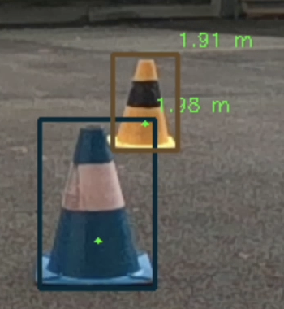
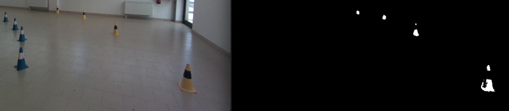
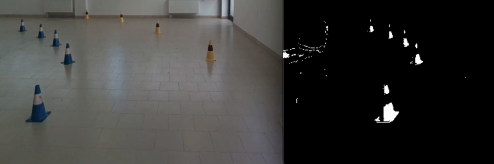
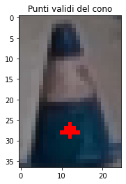
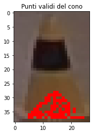
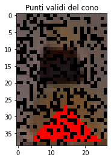

# Computer Vision

## Requirements

`Python >= 3.9`

installa le librerie richieste con il comando:

```bash
pip install -r requirements.txt
```

## How to use

Per avviare cv si deve usare il file `run.py`

### Opzioni di avvio

- `-i`, `--src_video`
Percorso del file video da analizzare. 
Se non specificato, viene utilizzato lo stream (con la d455 collegata).

- `-s`, `--src_settings`
Percorso del file di calibrazione/impostazioni della camera. 
Se non specificato, vengono utilizzati dei valori di default.

- `-d`, `--display`
Abilita la visualizzazione del frame con i coni individuati e le loro informazioni.

- `-c`, `--cuda`
Abilita l'esecuzione dell'algoritmo su GPU tramite CUDA.
(È necessaria una scheda video NVIDIA.)

- `--sbs` Abilita il video "step by step" (in waitKey 0).

- `-bgr`, `--convert_bgr`
Converte il frame in formato BGR, per i video registrati in RGB o per il SIL Test.

- `-rcv`, `--record-cv`
Abilita la registrazione del video in formato .mp4 di openCV.

- `-rbag`, `--record-bag`
Abilita la registrazione del video in formato .bag.

- `--depth`
Mostra il frame di profondità.

- `--save-cones`
Salva i coni con timestamp su file.

- `--log-error`
Salva l'errore del frame di profondità e il tempo di acquisizione dei frame, con l'accelerazione sui 3 assi, in un grafico.

### Utilizzo

Esegui il file run.py con le opzioni desiderate. Ad esempio:

```python3
python run.py -i video.bag -s settings.json -v
```

Questo eseguirà il modulo sul video video.bag utilizzando le impostazioni da settings.json e abiliterà il logging dettagliato.

---

## Funzionamento

Questo modulo di Computer Vision è progettato per il riconoscimenti dei coni per il sistema ADAS.

I coni vengono riconosciuti e classificati in base al colore e alla posizione.

#### Pipeline

1. Acquizione dei frame di colore e profondità
2. Riconoscimento dei coni
3. Discriminazione dei coni
4. Classificazione del colore dei coni
5. Calcolo della distanza dei coni
6. Calcolo della posizione dei coni

Di seguio vengono descritti i vari passaggi e le parti principali del modulo.

#### Classe ComputerVision

Per utilizzare il modulo, creare un'istanza della classe `ComputerVision` e chiamare il metodo `getCones` su ogni frame del video.

```python3
cv = ComputerVision(cuda: Optional[bool]=False, enable_display: Optional[bool]=False, 
			  convert_bgr: Optional[bool]=False, record: Optional[bool]=False, bag_name: Optional[str]="")
```

- `cuda`: abilita l'esecuzione su GPU tramite CUDA (richiede scheda video NVIDIA)
- `enable_display`: abilita la visualizzazione dei frame con i coni individuati e le loro informazioni
- `convert_bgr`: converte il frame da RGB a BGR
- `record`: abilita la registrazione del video (solo per openCV)
- `bag_name`: nome del file bag, usato per la registrazione del video

Il metodo `getCones` restituisce le informazioni dei coni individuati nel frame

```python3
cones_x, cones_y, cones_color, color_confidences, pos_confidences, timestamp = cv.getCones(color_frame, depth_frame)
```
input:
- `color_frame`: frame del colore
- `depth_frame`: frame di profondità

output:
- `cones_x`: posizione x dei coni
- `cones_y`: posizione y dei coni
- `cones_color`: colore dei coni
- `color_confidences`: confidenza del colore dei coni
- `pos_confidences`: confidenza della posizione dei coni (equivale alla confidenza della distanza)
- `timestamp`: timestamp di quanto è stato passato il frame

Per chiudere le finestre aperte e rilasciare le risorse, chiamare il metodo `close`

```python3
cv.close()
```

#### Classe Cone

La classe `Cone` rappresenta un cono rilevato, utilizzata per semplificare la manipolazione e gestione dei coni.

```python3
cone = Cone(x1, y1, x2, y2, confidence, frames)
```

Dopo aver creato un'istanza della classe `Cone`, è possibile accedere alle seguenti proprietà:
- `width`: larghezza del cono
- `height`: altezza del cono
- `area`: area del cono
- `center`: centro del cono (x, y)
- `color`: colore del cono \*
- `color_confidence`: confidenza del colore del cono \*\*
- `hsv_mask`: maschera HSV del colore del cono \*
- `distance`: distanza del cono dalla camera \*
- `position`: posizione del cono rispetto al baricentro della macchina \*
- `distance_confidence`: confidenza della posizione del cono \*\*

\* Queste proprietà vengono calcolate e salvate, in modo che siano disponibili senza dover ricalcolare i valori.
\*\* Queste proprietà dipendono dal calcolo di altre proprietà e sono inizializzate a valori nulli

#### Classe Frames

La classe `Frames` rappresenta un frame di colore e profondità e contiene funzionalità per la manipolazione dei frame.

Proprietà:
- `width`: Ritorna la larghezza del frame di colore.
- `height`: Ritorna l'altezza del frame di colore.
- `area`: Calcola l'area del frame di colore.

Metodi:
- `resize`: Ridimensiona il frame di colore e di profondità.
- `rgb2bgr`: Converte il frame da RGB a BGR.
- `get_original_pos`: Ritorna le coordinate originali del frame prima del resize.
- `get_depth_error`: Calcola la percentuale di pixel con errore nel frame di profondità.
- `get_depth`: Ritorna la distanza del punto nel frame di profondità in metri.
- `get_color`: Ritorna il colore del punto nel frame di colore in formato BGR.
- `show`: Mostra il frame di colore.
- `print_bbox`: Aggiunge le bounding box sul frame di colore e le informazioni associate.

#### File di config

Tutte le configurazioni di Computer Vision sono state centralizzate nel file `config.py` in modo da poter essere facilmente visualizzate e modificate.

### Riconoscimento cono



Il riconoscimento dei coni è basato su `YoloV5`, un modello di deep learning per il rilevamento oggetti in immagini.

Repo del codice originale:
https://github.com/FastCharge-Driverless/cone-detection-system

Il modulo è composto da tre classi principali: `InferenceEngine`, `MultithreadingInferenceFacade` e `ConeDetector`.

#### InferenceEngine

La classe `InferenceEngine` è responsabile per l'esecuzione dell'inferenza del modello di deep learning. Questa classe carica il modello, esegue l'inferenza su un'immagine e processa i risultati dell'inferenza.

#### MultithreadingInferenceFacade
- La classe `MultithreadingInferenceFacade` è un wrapper multithreading per `InferenceEngine`. Questa classe consente di eseguire l'inferenza su più immagini in parallelo utilizzando più thread.

#### ConeDetector
La classe `ConeDetector` utilizza `InferenceEngine` e `MultithreadingInferenceFacade` per rilevare i coni in un'immagine. Questa classe divide l'immagine in tre parti (sinistra, destra e centro) e esegue l'inferenza su ciascuna parte in parallelo. I risultati dell'inferenza vengono quindi combinati per ottenere la lista finale dei coni rilevati.

#### Fix coni sdoppiati
Il terzo sottoframe (centrale) è stato aggiunto per fixare il problema dello sdoppiamento dei coni rilevati al centro del frame tra i due sottoframe sinistro e destro.
Vengono aggiunti tutte le bounding box rilevate nel sottoframe centrale che intersecano l'asse che divide i sottoframe sinistro e destro.

#### Utilizzo
Per utilizzare questo modulo, creare un'istanza della classe `ConeDetector` e chiamare il metodo `forward` passando l'immagine come parametro. Ad esempio:

```python3
cd = ConeDetector(device='cpu', weights='weights.pt')
cones = cd.forward(image)
```

Questo eseguirà il rilevamento dei coni sull'immagine e restituirà una lista di coni rilevati. Ogni cono è rappresentato come una lista di cinque elementi: le coordinate `x1, y1, x2, y2` del rettangolo delimitatore del cono e la confidenza del rilevamento.

### Riconoscimento colore cono

Viene creata una maschera HSV per ogni colore (giallo, blu e arancione) e viene calcolata la percentuale di pixel che combaciano con la maschera. La percentuale più alta determina il colore del cono.

La confidenza del colore dipenda da:
- La percentuale di pixel che combaciano con la maschera (quanto è vicina al 60%)
- La grandezza della bounding box (che pesa fino a che un lato della bb è < `config.BB_DIM_COLOR_CONF`)
- Quanto le altre percentuali sono vicine a 0

esempi di maschere:



#### Scelte progettuali

E' stato scelto di usare delle maschere HSV perchè:
- Permette di confrontare i possibili colori dei coni facilmente, tramite la percentuale di pixel che combaciano con la maschera
- Il calcolo dipende dai dati di tutta la bounding box, non solo da un punto
- E' facile da visualizzare e da interpretare applicando le diverse maschere ai frame
- Permette di isolare il singolo cono, assumendo che le maschere siano impostate correttamente
e lo sfondo non contenga colori simili ai coni
- Un controllo su un singolo punto o più punti fissi può facilmente sbagliare prendendo il colore dello sfondo o della banda centrale del cono

Contro:
- La maschera deve essere impostata correttamente e può dipendere dalla luce
- Può esserci del rumore dovuto allo sfondo o da bounding box che si sovrappongono

### Calcolo distanza cono

Viene utilizzato il frame di profondità per calcolare la distanza del cono.
Ogni pixel del frame di profondità rappresenta la distanza in quel punto.

La classe `ConeDepth` permette di iterare sui punti del cono validi per il calcolo della distanza.
Parte da `start_point` e scende prendendo i punti formando una triangolo come in figura.
Vengono restituiti solo i punti validi, usando:
- `validate_color`: Controlla se un punto è nel range di colore del cono.
- `validate_depth`: Controlla se la distanza è in un range valido (`config.MIN_DISTANCE`, `config.MAX_DISTANCE`)

La funzione 
```python3
def getConeDistance(cone) -> Tuple[Union[float, None], float]:
```
utilizza la classe `ConeDepth` per calcolare la distanza del cono.
Vengono usati `config.MAX_POINTS` punti validi restituiti dalla classe e viene restituita la media delle distanze.
Se nessun punto viene individuato, viene presa la distanza solo del punto `start_point` e controllato solo se il range è valido
Se non è valido, viene restituito `None`

Il calcolo della confidence della distanza dipende da:
- Quanti punti validi sono stati usati per calcolare la distanza
- Quanto è vicino il cono (dato dall'errore della camera a grandi distanze)

Esempi: (con rumore nel frame di profondità e nel frame del colore)

  

#### Scelte progettuali

- Questo metodo permette di minimizzare la possibilità di prendere la distanza in punti che non sono del cono.
- Utilizza più punti e facendo la media viene minimizzato l'errore.
- Vengono scartati i punti con distanza non valida (= 0)

contro:
- Vengono usati solo alcuni punti per calcolare la distanza
- Un semplice calcolo matriciale potrebbe essere più veloce

### Calcolo posizione cono

La funzione `position` calcola la posizione di un punto rispetto al baricentro della macchina.

Parametri:

- `pixelAsc`: La coordinata ascissa del punto in pixel.
- `pixelOrd`: La coordinata ordinata del punto in pixel.
- `distance`: La distanza del punto

Ritorno:
Ritorna un vettore `V=(X;Y;Z)` che rappresenta la posizione del punto rispetto al baricentro della macchina (impostare correttamente la posizione della camera rispetto al baricentro della macchina in `config.CAMERA_POS`).
Il sistema di riferimento è composto dall'asse x che punta verso il cono (= distanza), l'asse y orizzontale con verso positivo verso sinistra (distanza dal centro), e l'asse z verticale con verso positivo verso l'alto.

### Discriminazione coni

Ogni bounding box rilevata viene validata, controllando:
- le dimensioni della bounding box
	- larghezza minima e massima (`config.MIN_BB_WIDTH`, `config.MAX_BB_WIDTH`)
	- altezza minima e massima (`config.MIN_BB_HEIGHT`, `config.MAX_BB_HEIGHT`)
	- rapporto altezza/larghezza (`config.MIN_BB_RATIO`, `config.MAX_BB_RATIO`)
	- le dimensioni reali (in metri) della bb (`MIN_REAL_BB_WIDTH`, `MIN_REAL_BB_HEIGHT`, `MAX_REAL_BB_WIDTH`, `MAX_REAL_BB_HEIGHT`)
- la posizione della bounding box
	- non deve toccare i bordi del frame (`config.BB_MAX_DISTANCE_FROM_BORDER`)
- la compenetrazione con gli altri coni
	- non deve compenetrarsi con gli altri coni di una certa percentuale  (`config.BB_COMPENETRATION_PERCENT`)
	- se si compenetrano, il cono più grande è valido
- controllo della distanza
	- controlla che la distanza sia valida e che la confidenza sia maggiore di un certo valore `config.DISTANCE_MIN_CONFIDENCE`

```python3
def validateCone(cone, cones: List) -> bool:
````
Parametri:
- cone: cono da validare (oggetto Cone)
- cones: lista dei coni successivi (oggetti Cone) ancora da validare

Se un cono non è valido ritorna false e modifica il parametro `deleted`

```python3
cone.deleted
```

Se un cono viene scartato, avrà la bb grigia e comparirà un messaggio di errore rosso al centro della bb.

#### Scelte progettuali

Questo permette di minimizzare gli errori andando a scartare tutte quelle bounding box che sono probabilmente non valide (es allucinazioni di coni lontani e di grandi dimensioni) o che molto probabilmente porteranno a degli errori in seguito (es bb che si compenetra con altri coni).

Si cerca di restituire a slam meno errori possibili.

### DepthCamera

La classe `DepthCamera` gestisce la camera di profondità Intel RealSense D455.

#### Metodi:

- `get_frame`: Ritorna i frame di profondità, profondità colorato (per la visualizzazione), colore (BGR o RGB), accelerometro e giroscopio.
- `release`: Interrompe la pipeline della camera di profondità.
- `get_depth_error`: Calcola la percentuale di pixel con errore nel frame di profondità.

#### Utilizzo:

```python3
camera = DepthCamera(nomeFile, settings, record=False)
depth_image, color_image, accel, gyro, depth_color_image = camera.get_frame()
camera.release()
error = DepthCamera.get_depth_error(depth_image)
```

Dove `nomeFile` è il nome del file di registrazione (usare "stream" se si vuole usare lo stream della d455 collegata), `settings` è il nome del file di impostazioni e `record` è un flag booleano per avviare la registrazione dei frame (in formato .bag).

## Proposte di miglioramento

### Yolo V8/9

Si sta considerando di utilizzare una versione di Yolo più recente, per velocizzare e migliorare il riconoscimento dei coni.

### Segmentazione

Si sta considerando di utilizzare un modello di segmentazione per isolare i coni dallo sfondo.
Questo permetterebbe di:
- Rendere il riconoscimento del colore del cono privo di errore
- Si può cambiare del tutto il ricoscimento del colore usando la media dei valori bgr, confrontando con il colore del cono. Le maschere hsv sono utili nel caso attuale, ma portano con se alcuni problemi.
- Rendere il calcolo della distanza più preciso e veloce:
	- si imposta lo sfondo con distanza pari a 0
	- Si calcola la media dei punti nel frame di profondità non considerando i pixel con valore nullo

### Tracciamento

Permetterebbe di distinguere e identificare i diversi coni tra frame successivi.
Questo permetterebbe a slam di diminuire l'errore e di conseguenza l'intorno di approssimazione della posizione del cono.

### Addattamento della maschera HSV alla maggior parte dei contesti di gara

Il calcolo del colore deve funzionare in qualsiasi contesto di gara in termini di illuminazione


